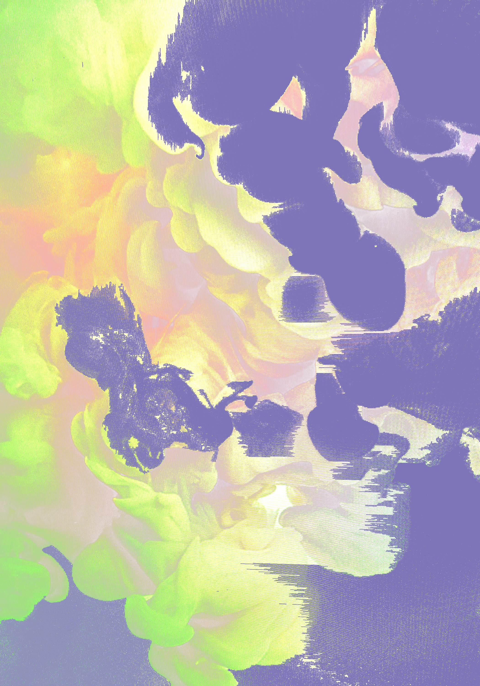

        
      
      <section>
        <h1>Design</h1>
        <main class="mainlayout">
        
        <section>
          
          <article class="card">
            

              
            

            

              <h1 class="card__header">"Monkey D. Luffy" Portrait</h1>
              
An artwork portrait made based off the character Monkey D. Luffy from the animation series, One Piece.

            

          </article>

        <article class="card">
          

            

              <h1 class="card__header">Magazine page for Fashion Company Idea</h1>
              
A design made for an idea, of a fashion magazine page promoting a company that offers services and manufacturing.

            

          </article>
    
        <article class="card">
          

          

            <h1 class="card__header">"Black Hole Depiction"</h1>
            
An artistic approach at attempting to recreate the formation of a black hole in space.

          

        </article>
      
      <article class="card">
        

          

            <h1 class="card__header">"Water Color"</h1>
            
 A design based off inspiration for a water color medium in an artistic way.

          

        </article>
      
        </section>
    